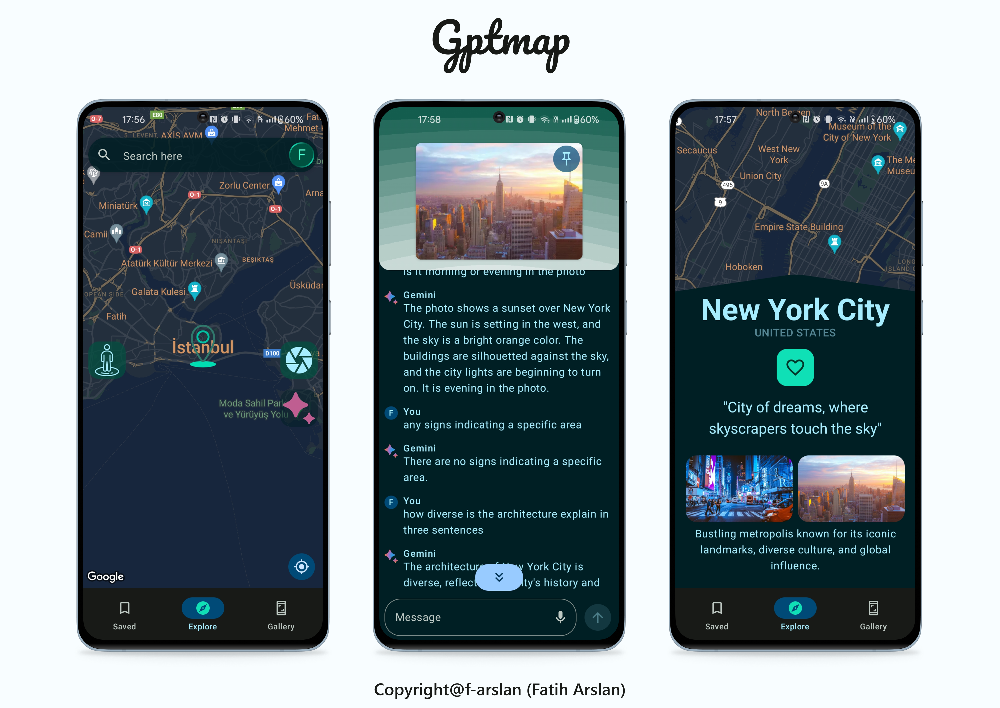
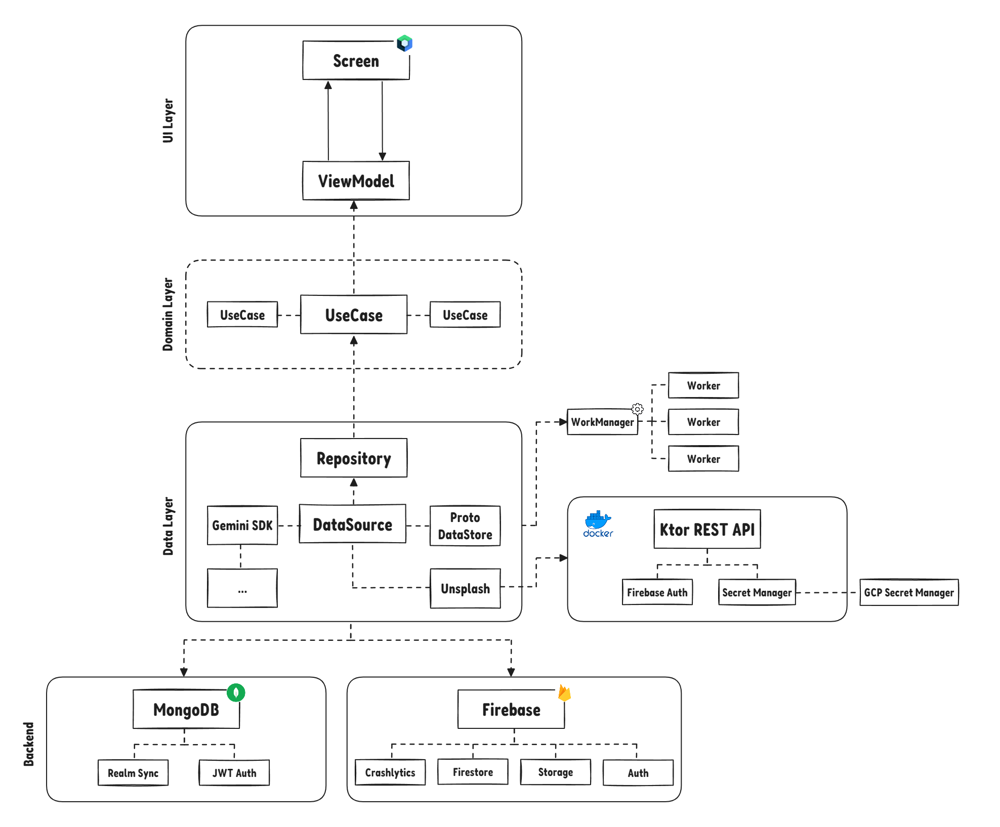

---
runme:
  id: 01HQGK9942PRCD1VKM5D2W2VJP
  version: v3
---

<h1 align="center">Gptmap🗺️🤖</h1>
<p align="center">Welcome to Gptmap, a startup project crafted using Kotlin and Jetpack Compose.</p>
 <p align="center" text-align="center">This project will guide you through creating a comprehensive Android application using a modern toolkit, highlighting the integration of AI technologies and illustrating the real-world applications of these advanced technologies, providing valuable insights and best practices.</p>



## Download

Go to the [Releases](https://github.com/f-arslan/GptMap/releases) to download the latest APK.

## Table of Contents

- [Tech Stack & Open-source Libraries](#tech-stack--open-source-libraries)
- [Architecture Overview](#architecture-overview)
- [App Demos](#app-demos)
- [Setup and Configuration Guide](#setup-and-configuration-guide)

## Tech Stack & Open-source Libraries

- **[Kotlin](https://kotlinlang.org/)**: The primary language for application development, emphasizing safety, simplicity, and interoperability.
- **[Jetpack Compose](https://developer.android.com/jetpack/compose)**: Used for modern UI development, leveraging custom composables and animations for a dynamic and responsive design.
- **Jetpack Libraries**:
   - **ViewModel**: Centralizes UI-related data management, making it resilient to configuration changes.
   - **Lifecycle**: Observes component lifecycles to ensure appropriate UI actions are taken at each stage.
   - **SavedStateHandle**: Enhances state management by preserving UI data across system-initiated process terminations.
   - **DataStore**: A modern data storage solution that utilizes Kotlin coroutines and Flow to store data asynchronously, securely, and consistently, serving as a replacement for SharedPreferences.

- **[Ktor](https://ktor.io/)**: Enables server and client-side HTTP communications, seamlessly integrating with various third-party APIs for extended functionality.
- **Database and Storage Solutions**:
   - **MongoDB Realm**: Provides a robust local database and synchronization solutions, enabling efficient offline data access and seamless cloud integration. It also implements **JWT Authentication** for secure user authentication and data access.
   - **Firebase Firestore and Storage**: Facilitates real-time data synchronization and scalable cloud storage, ensuring smooth data operations and media management.

- **Asynchronous Programming**:
   - **[Coroutines](https://github.com/Kotlin/kotlinx.coroutines)** and **[Flow](https://kotlin.github.io/kotlinx.coroutines/kotlinx-coroutines-core/kotlinx.coroutines.flow/)**: Manage asynchronous tasks and streamline data stream processing, guaranteeing a smooth user experience.

- **Authentication Systems**:
   - **Firebase Auth**: Offers support for diverse authentication mechanisms, including email & password and Gmail, ensuring secure user access and streamlined account management.
   - **[MongoDB Realm JWT Auth](https://www.mongodb.com/docs/atlas/app-services/authentication/custom-jwt/)**: Implements JSON Web Token (JWT) authentication to ensure secure and scalable user authentication within the MongoDB Realm ecosystem.

- **Dependency Injection Frameworks**:
   - **[Dagger2](https://dagger.dev/)**, **[Hilt](https://dagger.dev/hilt/)**, and **[Koin](https://insert-koin.io/)**: Provide scalable and maintainable object creation and management, optimizing app architecture and development workflow.

- **APIs & Services Integration**:
   - **Google Maps API**: Enhances app functionality with comprehensive mapping and location services.
   - **Third-party APIs (Gemini, Unsplash)**: Enrich the application with a diverse range of services, including cryptocurrency data, AI-generated content, and high-quality images.

- **Image Loading and Animation Libraries**:
   - **Coil**: Efficiently loads and displays images, optimizing memory and network usage.
   - **Lottie**: Implements complex animations sourced from JSON files, enriching the UI with engaging visuals.

- **Material Design 3**: Adopts the latest Material Design guidelines for a cohesive, dynamic user interface and enhanced user experience, leveraging the newest components, theming, and layout principles.
- **[Kotlin Symbol Processing (KSP)](https://github.com/google/ksp)**: Streamlines code generation and processing, enhancing development efficiency.
- **WorkManager**: Manages background tasks and asynchronous operations, ensuring reliable execution under various system conditions.
- **Architectural Patterns**:
   - **MVVM and MVI**: Adopt modern architectural patterns for a clean separation of concerns, facilitating the development of testable and maintainable code.

- **Core Android Features**:
   - Utilizes Services, Broadcast Receivers, and Intents for robust background processing and inter-component communication.

- **Project Organization**:
   - Implements a multi-module structure with a version catalogue, promoting modular development and easier dependency management.

- **Networking**:
   - **[Retrofit](https://github.com/square/retrofit)**: Simplifies REST API communication, enhancing data exchange and integration.

- **[Docker](https://www.docker.com/)**: Utilizes container technology for consistent development, testing, and deployment environments.
- **Secure Management**:
   - **GCP Secret Manager**: Safeguards sensitive information, ensuring secure access and storage of secrets.

- **Testing Suite**:
   - Employs **JUnit 4 & 5**, **[Mockk](https://mockk.io/)**, and **[turbine](https://github.com/cashapp/turbine)** for comprehensive testing across units and integration points.

- **Code Quality Tools**:
   - **Detekt**: Monitors code quality and maintainability, enforcing best practices and coding standards.

### Architecture Overview



<p>This project is designed following the principles of Clean Architecture, utilizing a multi-modular approach. It includes several layers, including the UI Layer, Domain Layer, Data Layer, and the backend, to ensure a solid separation of concerns and enhance maintainability.

For the backend, Ktor for server-side logic, MongoDB for database management (Realm Sync and Auth for synchronization and authentication), Firebase for authentication, storage, and real-time database capabilities (Auth, Storage, Firestore), and GCP's Secret Manager for secure management of secrets and API keys.

## App Demos

Check out the [resources](public/) for the full list.

https://github.com/f-arslan/GptMap/assets/66749900/68769bcf-8dcc-4e9d-8bec-6d6f393dc7b6

https://github.com/f-arslan/GptMap/assets/66749900/37f69fa5-bd37-41da-8688-15c74ce8adaf

https://github.com/f-arslan/GptMap/assets/66749900/889fdcf8-8989-4d2d-8752-88cdbe6747cb

### Setup and Configuration Guide

Getting started with this project involves several key steps to ensure everything is set up correctly. Follow this guide to configure your development environment and integrate all necessary services:

1. **Android Studio Iguana**: This project is optimized for Android Studio Iguana. While it might work on lower versions, Gradle plugin 8.2.2 is required for the best experience. If you're using an older version, consider updating to avoid compatibility issues.
2. **Setting up `local.properties`**: This file contains essential environment variables. You won't need an OpenAI key as it will be deprecated. Fill in the necessary API keys and URLs except for the OpenAI key:

```properties {"id":"01HQGK9942PRCD1VKM59AC6BYM"}
sdk.dir=<path_to_your_android_sdk>
MAPS_API_KEY=<your_google_maps_api_key>
OPENAI_API_KEY= (will be deprecated, no need to fill this)
PALM_API_KEY=<your_gemini_api_key>
UNSPLASH_BASE_URL=<unsplash_api_base_url>

```

Ensure you replace placeholder text with actual values relevant to your development environment.

3. **Remove Keystore Related Configurations**: For development purposes, remove or comment out any keystore configurations in your Gradle build files. This simplifies the build process for initial setup and testing.
4. **Setup Docker and GCP Secret Manager**: Docker is used for containerization, ensuring a consistent environment for development and deployment. GCP Secret Manager stores and manages access to your application's secrets. Skipping this step means you won't be able to use AI features on images, though you can still proceed with other functionalities. For Docker, install Docker and follow the setup instructions for your OS. For GCP Secret Manager, set up a GCP account, create a new project, and follow the instructions to store your secrets.
5. **Firebase Setup**: To integrate Firebase, create a new project in the Firebase console, register your app, and download the `google-services.json` file. Place this file in your app's `app` directory. This step is crucial for utilizing Firebase Auth, Firestore, and Storage.
6. **MongoDB Atlas Setup**: Sign up or log in to MongoDB Atlas, create a new cluster, and connect your application using the provided connection string. Ensure you've configured the network access and database user for your cluster.
7. **GCP Account Requirement**: A Google Cloud Platform (GCP) account is necessary for utilizing Google Maps API and GCP Secret Manager. If you don't already have an account, sign up at [GCP's website](https://cloud.google.com/) and set up billing to access these services.


